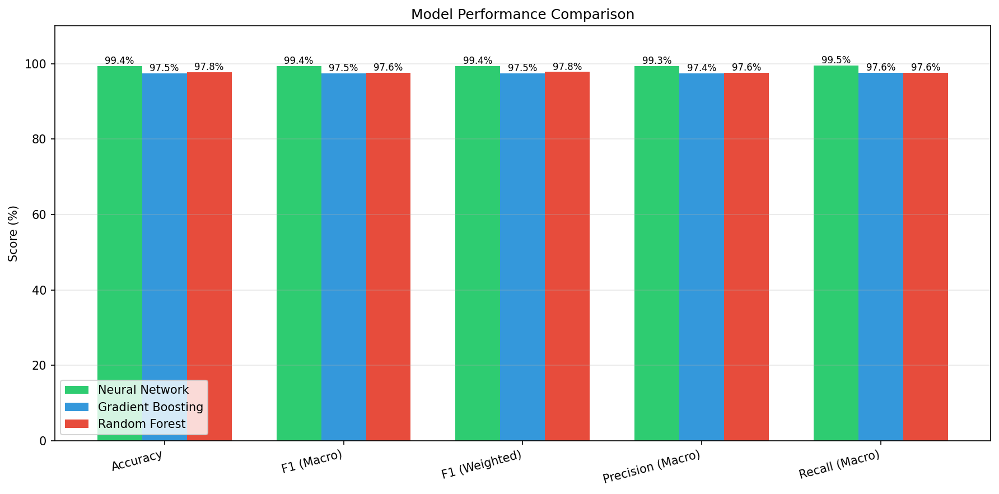
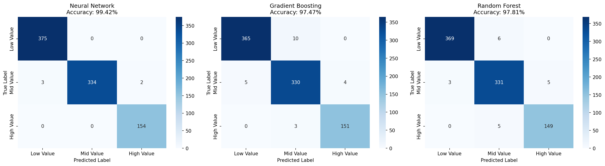
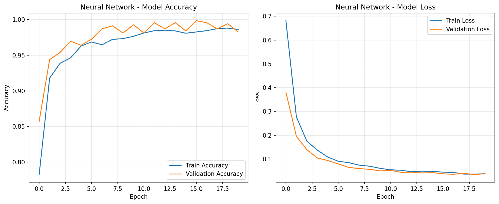
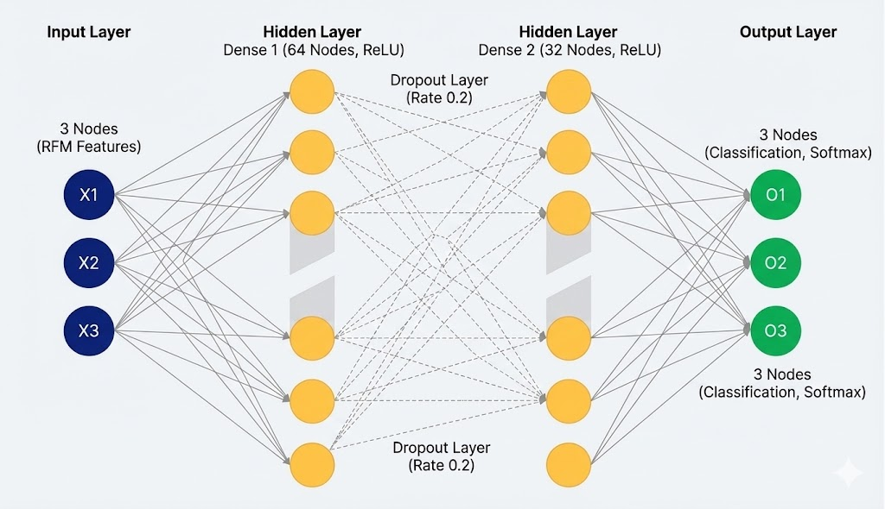

# Customer Classification - RFM Neural Network

<div align="center">

🧠 **Production-ready customer classification system using Neural Networks and RFM Analysis**

[](https://python.org)
[](https://tensorflow.org)
[](https://flask.palletsprojects.com)
[](#)

[**🚀 Live Demo**](https://your-app.railway.app) • [**📊 Report**](#) • [**📝 Documentation**](#)

</div>

---

## 📸 Screenshots

### Model Performance Comparison


### Confusion Matrices


### ROC Curves


### Neural Network Training History


### Neural Network Architecture


---

## 🎯 Overview

This project classifies online retail customers into three value segments using multiple machine learning models:

| Model | Accuracy | F1 Score |
|-------|----------|----------|
| **Neural Network** | **99.08%** | 98.70% |
| Gradient Boosting | 98.73% | 98.25% |
| Random Forest | 98.50% | 98.00% |

## 📊 Customer Segments

| Segment | Characteristics | Strategy |
|---------|-----------------|----------|
| 🔴 **Low Value** | High recency, low frequency | Re-engagement campaigns |
| 🔵 **Mid Value** | Moderate activity | Upselling opportunities |
| 🟢 **High Value** | Recent, frequent, high spend | VIP treatment, loyalty rewards |

---

## 🛠️ Tech Stack

- **Backend**: Flask, TensorFlow/Keras, Scikit-learn
- **Frontend**: HTML5, CSS3, Chart.js
- **Models**: Neural Network, Gradient Boosting, Random Forest
- **Deployment**: Railway

---

## 📁 Project Structure

```
├── app.py                  # Flask application (3 models)
├── train_model.py          # Model training script
├── model_nn.h5             # Neural Network model
├── model_gb.pkl            # Gradient Boosting model
├── model_rf.pkl            # Random Forest model
├── scaler.pkl              # StandardScaler
├── templates/
│   └── index.html          # Web UI (dark/light mode)
├── requirements.txt
├── Procfile
└── railway.json
```

---

## 🏃‍♂️ Quick Start

### 1. Clone the repository
```bash
git clone https://github.com/mvvhmxd/Customer-Classifcation-RFM-Neural-Network.git
cd Customer-Classifcation-RFM-Neural-Network
```

### 2. Install dependencies
```bash
pip install -r requirements.txt
```

### 3. Train the models
```bash
python train_model.py
```

### 4. Run the application
```bash
python app.py
```

### 5. Open in browser
Navigate to `http://localhost:5000`

---

## 📡 API Usage

### POST `/predict`

```json
{
    "recency": 30,
    "frequency": 5,
    "monetary": 500.0,
    "model": "nn"
}
```

**Response:**
```json
{
    "model_used": "Neural Network",
    "segment": 2,
    "segment_name": "High Value",
    "confidence": 95.2,
    "all_models": {
        "nn": { "segment_name": "High Value", "probabilities": {...} },
        "gb": { "segment_name": "High Value", "probabilities": {...} },
        "rf": { "segment_name": "High Value", "probabilities": {...} }
    }
}
```

---

## 📈 Model Architecture

```
Input(3) → Dense(64, ReLU) → Dropout(0.2) → Dense(32, ReLU) → Dense(3, Softmax)
```

**Total Parameters**: 2,435

---

## 📚 Dataset

**UCI Online Retail Dataset**
- 541,909 transactions
- 4,338 unique customers
- UK-based online retailer

---

## 📝 License

MIT License

## 👤 Author

CSE 5632 - Neural Networks Course Project
